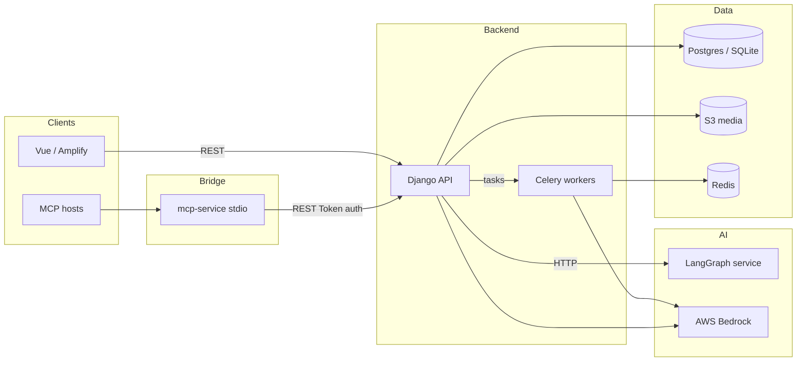

# BigBoy

**AI-native learning platform** — turn documents, research, and **MCP conversation imports** into **subjects, topics, instructional bites, and quizzes**, with **RAG-backed chat** over your sources and **AWS Bedrock** for generation.


---

## The problem

Workplace and course knowledge lives in PDFs, tools, and chat threads. BigBoy **centralizes ingest**, lets learners **explore** (chat, research, imports), then **promotes** structured curriculum artifacts they can follow in lessons, reviews, and quizzes.

---

## Systems (repository map)

| # | System | Role | Path / entry |
|---|--------|------|----------------|
| 1 | **Web app** | Vue 3 + Vite + Tailwind; API client, Explore flows, markdown LLM output | `frontend-vue/` — build: `npm run build`. Deploy: **AWS Amplify** via root `amplify.yml` (`appRoot: frontend-vue`). |
| 2 | **API & core domain** | Django REST: auth, subjects, sources (documents / research / **MCP imports**), RAG, chats, quizzes, reviews | `backend/` — `uv run gunicorn` / `manage.py`. **Docker:** `backend/Dockerfile` |
| 3 | **AI workflow service** | LangGraph-style HTTP service (research / orchestration), callable from the API | `langgraph-service/` — Uvicorn. **Docker:** `langgraph-service/Dockerfile` |
| 4 | **MCP bridge service** | **Model Context Protocol** (stdio) server that **POSTs conversation imports** to the Django API (`/api/v1/mcp-imports/`) so Cursor, Claude Desktop, or other MCP hosts can push transcripts into Explore → Conversation imports | `mcp-service/` — `uv sync` then `uv run python main.py`. See [`mcp-service/README.md`](mcp-service/README.md). **Env:** `BIGBOY_API_BASE_URL`, `BIGBOY_API_TOKEN`. |
| 5 | **Infrastructure** | **AWS CDK** (IaC): VPC, RDS Postgres, **ECS Fargate** (Django + ALB, LangGraph + private discovery), **CloudFront**, **Amplify** app wiring. **Alternate path:** **App Runner** + ECR + VPC connector + scripts for `us-east-2` | `infra/` — see `infra/README.md` and `infra/bin/bigboy.ts` |
| — | **Async work** | Celery workers for background tasks (e.g. document indexing); **Redis** broker/result | Started with API in `backend/entrypoint.sh` in containerized deploys; or separate `celery` process locally. |

**Data & AI (managed services):** PostgreSQL (Aurora/RDS or local SQLite for dev), **S3** for user media when configured, **Amazon Bedrock** for embeddings and LLM calls, **Redis** for Celery.



---

## Tech stack (high level)

- **Language / runtime:** Python 3.12+ (Django, LangGraph service, MCP bridge), Node 20+ (frontend build)
- **Frameworks:** Django + DRF, Vue 3, LangChain / Bedrock integration, Celery; **MCP** (`mcp-service`) for external assistants pushing imports over REST
- **Package / env:** `uv` (Python), `npm` (Vue)
- **IaC & delivery:** **AWS CDK (TypeScript)**; **Amplify Hosting** for SPA; **ECS Fargate** or **App Runner** for APIs depending on deployment path; **ECR** for images

---

## Dockerization

| Image | Build | Run (example) |
|--------|--------|----------------|
| **Django API** (includes migrations + Gunicorn + in-container Celery worker) | `docker build -f backend/Dockerfile backend` | Binds `8000`; `ENTRYPOINT` is `entrypoint.sh` (migrate, Celery, Gunicorn). |
| **LangGraph service** | `docker build -f langgraph-service/Dockerfile langgraph-service` | Uvicorn on `8765`. |

See `backend/entrypoint.sh` for the exact start sequence (migrations → Celery → Gunicorn).

**Frontend** is a static Vite build (no production Node server in-repo); Amplify runs `npm ci` / `npm run build` per `amplify.yml`.

---

## Deployment options

1. **CDK stack (full cloud reference architecture)**  
   - **Amplify** for the SPA, **CloudFront** in front of the API ALB, **ECS Fargate** for Django and LangGraph, **RDS** in private/isolated layout.  
   - See **`infra/README.md`** and deploy from `infra/` with `npx cdk deploy`.

2. **App Runner + PowerShell (alternative, e.g. `us-east-2`)**  
   - ECR images, **VPC connector** to RDS, optional **S3** for media, health checks.  
   - See **`infra/scripts/app-runner/README.md`**.

3. **Local**  
   - `backend`: `uv run python manage.py runserver` (+ Celery worker in another terminal if you use async indexing).  
   - `frontend-vue`: `npm run dev`.  
   - `langgraph-service`: run Uvicorn per that package’s `README` / `pyproject` scripts.
   - `mcp-service`: `cd mcp-service && uv sync && uv run python main.py` (requires `BIGBOY_API_BASE_URL` + `BIGBOY_API_TOKEN`; see [`mcp-service/README.md`](mcp-service/README.md)).

---

## Observability

| Layer | What to use | Notes |
|--------|-------------|--------|
| **AWS** | **Amazon CloudWatch** (Logs + metrics for ECS, App Runner, Fargate tasks, load balancers) | Default sink for container stdout/stderr and service metrics; alarms for 5xx, latency, task health. |
| **LLM & workflows** | **LangSmith** (or compatible tracing) | Traces, latency, and quality signals for Bedrock / LangChain-style chains — ideal for RAG, curriculum generation, and prompt iteration. |
| **Application** | Django `LOGGING` in `config/settings.py` (console + file in dev) | `general.log` under the backend; structured verbose formatter. |

Tie CloudWatch to your **health** endpoint (e.g. lightweight `/healthz` for load balancers) and monitor Celery/Redis and DB connection errors in the same log streams.

---

## Environment variables

Configuration is **12-factor** style via a repo-root `.env` (or platform env) and `python-decouple` in `backend/config/settings.py`.

**Authoritative list:** the **module docstring** at the top of [`backend/config/settings.py`](backend/config/settings.py).

### Grouped reference

| Group | Variables (representative) |
|--------|----------------------------|
| **Core** | `SECRET_KEY`, `DEBUG`, `ALLOWED_HOSTS` |
| **Database** | `DATABASE_NAME`, `DATABASE_USER`, `DATABASE_PASSWORD`, `DATABASE_HOST`, `DATABASE_PORT` — *omit or empty `DATABASE_NAME` to use SQLite for local dev* |
| **AWS / Bedrock** | `AWS_ACCESS_KEY_ID`, `AWS_SECRET_ACCESS_KEY`, `AWS_REGION_NAME` — *omit keys on App Runner/ECS to use the task role*; `BEDROCK_MODEL_ID`, `BEDROCK_EMBEDDING_MODEL_ID` |
| **S3 media (optional)** | `AWS_S3_MEDIA_BUCKET_NAME`, `AWS_S3_REGION_NAME`, `AWS_S3_MEDIA_LOCATION`, `AWS_S3_CUSTOM_DOMAIN`, `AWS_S3_ENDPOINT_URL` |
| **Celery / Redis** | `CELERY_BROKER_URL`, `CELERY_RESULT_BACKEND`, or build from `REDIS_HOST`, `REDIS_PORT`, `REDIS_USERNAME`, `REDIS_PASSWORD` |
| **LangGraph service** | `LANGGRAPH_SERVICE_URL`, `LANGGRAPH_SERVICE_API_KEY`, `LANGGRAPH_SERVICE_TIMEOUT` |
| **Comms (optional)** | `TWILIO_*`, `SENDGRID_API_KEY`, `META_*` |
| **Frontend (Vite)** | `VITE_API_BASE_URL` (API base, include `/api/v1` as needed) — see [`frontend-vue/.env.example`](frontend-vue/.env.example) |
| **MCP bridge (`mcp-service`)** | `BIGBOY_API_BASE_URL` (same shape as Vite: include `/api/v1`), `BIGBOY_API_TOKEN` (DRF token, same as `Authorization: Token …`) — see [`mcp-service/.env.example`](mcp-service/.env.example) |

**S3 on AWS:** see also **[`backend/README.md`](backend/README.md)** for the App Runner + IAM flow and `infra/scripts/app-runner` usage.

**Never commit secrets:** keep `.env` out of VCS; use platform secrets (Amplify, Secrets Manager, App Runner) in production.

---

## Local quick start

```bash
# Backend
cd backend
uv sync
uv run python manage.py migrate
uv run python manage.py runserver

# Optional: async indexing (in another shell)
# uv run celery -A config.celery worker --loglevel=info --pool=solo
```

```bash
# Frontend
cd frontend-vue
npm ci
npm run dev
```

**LangGraph service** — install and run from `langgraph-service/` per its `pyproject.toml` and Dockerfile command (`uvicorn app.main:app` on port `8765` by default in the image).

**MCP bridge** — from `mcp-service/`:

```bash
cd mcp-service
cp .env.example .env   # set BIGBOY_API_BASE_URL and BIGBOY_API_TOKEN
uv sync
uv run python main.py
```

Wire this command into your MCP client (Cursor, Claude Desktop, etc.); details in [`mcp-service/README.md`](mcp-service/README.md).

---

## API documentation

- OpenAPI / Swagger: `http://127.0.0.1:8000/api/schema/swagger-ui/` (when backend is up)

---

## Tests

Django `TestCase` suites under app `tests/` packages, e.g. `backend/bigboy/quizzes/tests/`, `subjects/`, `reviews/`.

```bash
cd backend
uv run python manage.py test
```

---

## More documentation in-repo

| Document | Content |
|----------|--------|
| [`backend/README.md`](backend/README.md) | Backend setup, Celery, S3, ngrok, API docs link |
| [`mcp-service/README.md`](mcp-service/README.md) | MCP stdio server → Django `mcp-imports` API; env vars and Cursor config |
| [`infra/README.md`](infra/README.md) | CDK stack, Amplify, ECS Fargate, **App Runner** alternative scripts |

---

## License / attribution

This repository is the **BigBoy**. Use and extend per your team’s or course license terms.

**Repository:** [github.com/iyanuashiri/bigboy-project](https://github.com/iyanuashiri/bigboy-project)
